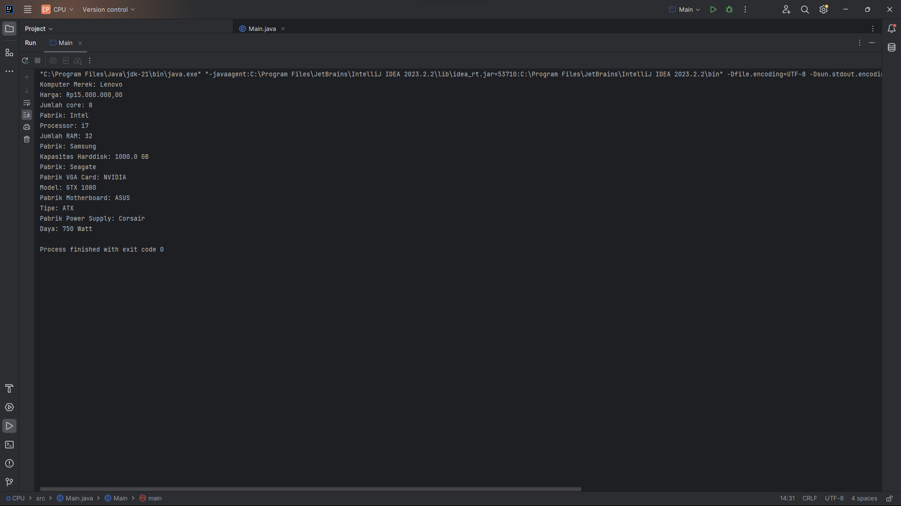

## Struktur Kode

1. **Main Class (`Main.java`):**
    - Kelas utama yang berisi metode `main`.
    - Membuat objek `CPU`.
    - Membuat objek `Processor` dan `RAM` sebagai contoh nested class.

2. **CPU Class (`CPU.java`):**
    - Kelas utama yang mewakili CPU komputer.
    - Memiliki nested class:
        - `Processor` untuk menggambarkan prosesor.
        - `RAM` untuk menggambarkan modul RAM.
        - `Harddisk` untuk menggambarkan harddisk.
        - `VGACard` untuk menggambarkan kartu grafis.
        - `Motherboard` untuk menggambarkan motherboard.
        - `PowerSupply` untuk menggambarkan catu daya.

    - Setiap nested class memiliki metode `getInfo` untuk mendapatkan informasi mereka masing-masing.

## Cara Menggunakan

1. Jalankan `Main.java`.
2. Objek `CPU` akan dibuat bersama dengan beberapa komponen seperti `Processor`, `RAM`, `Harddisk`, `VGACard`, `Motherboard`, dan `PowerSupply`.
3. Informasi dari setiap komponen akan ditampilkan melalui metode `getInfo`.

### Capture Program
Berikut adalah tangkapan layar hasil program:

